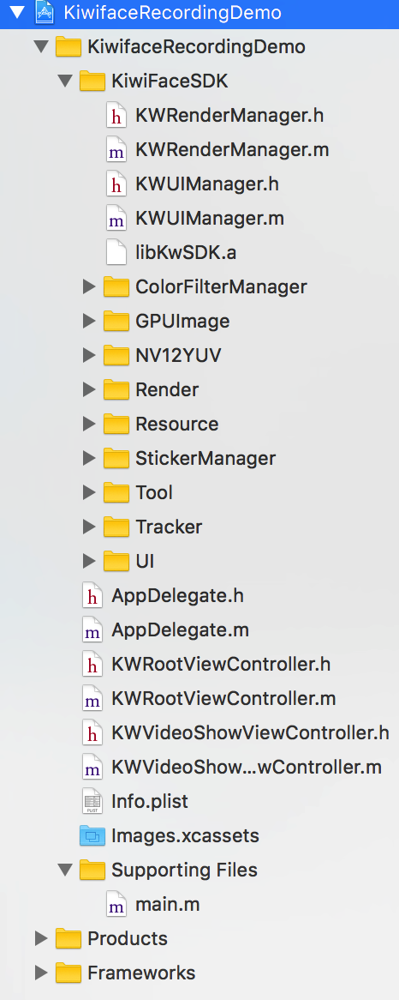
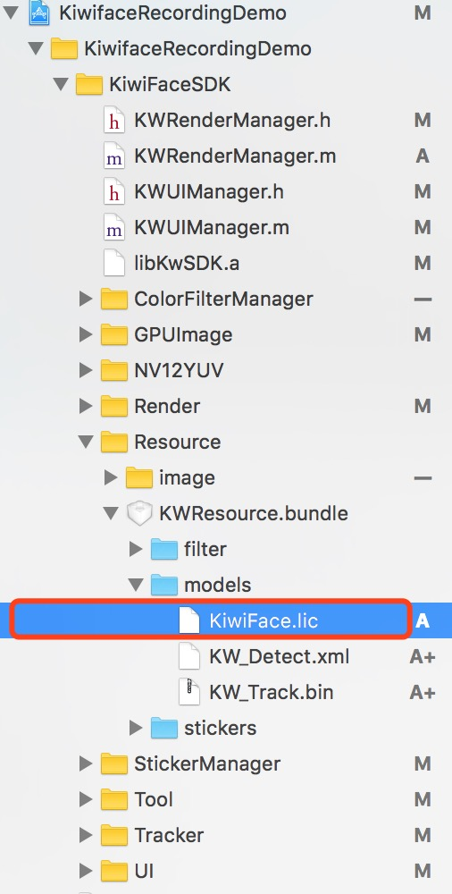

# Kiwi人脸跟踪SDK快速集成指南(iOS)

kiwi人脸跟踪SDK，主要功能包括：

- 静态图片的人脸以及关键点位置检测
- 68个人脸关键点的实时检测与跟踪（单人脸/多人脸）
- 美颜、哈哈镜等实时滤镜功能
- 趣味2D贴纸

我们的SDK针对移动端，在算法效率、硬件占用、性能精度等方面进行了相关优化，使其适用于移动端直播，美颜相机，滤镜相机，趣味贴纸，虚拟美妆等应用场景。

## 流程图

  

这个文档将演示如何利用我们的demo快速入门，并详细描述具体集成步骤。

## Demo快速入门

该demo基于GPUImage的短视频录制，实现了在短视频录制的场景下实现人脸跟踪以及趣味贴纸。

#### 准备环境

###### 开发环境要求

  软件
    * XCode 6.0 或以上版本
    * iOS 7.0 或以上版本

  硬件
    * 支持语音/视频的真机设备


#### 编译代码示例

1. 用XCode打开demo工程文件(KiwifaceRecordingDemo)。代码包含以下目录结构

  

2. 添加license文件
  - 将从官网下载下来的授权文件（试用此SDK需要在[Kiwi官方网站](http://www.kiwiar.com/demo)中注册，以获取绑定应用BundleID的License文件）放入KiwiFaceSDK/Resource/KWResource.bundle/models目录下

	
	
  - 请确认demo工程文件(KiwifaceRecordingDemo)的bundleID是否正确（网站注册时填写的bundleID）
3. 选中项目，点击 "Build and Run" 按钮进行编译

  示例截图

 |  |

p.s. 该示例只支持在真机上实现功能，不支持模拟器。编译完成后，即可运行。


## 具体集成步骤


#### 第一步：准备环境

软件
  * XCode 6.0 或以上版本
  * iOS 7.0 或以上版本

硬件
  * 支持语音/视频的真机设备


#### 第二步：项目所需库

  - __kiwi提供__（请从sdk文件夹中获取）
    * libfaceTrackerSDK.a（人脸捕捉SDK）
    * libKwSDK.a（UI＋视频帧渲染SDK）


  - __自行下载__（若项目中已经存在则不需要下载）

    必选：
    * GPUImage视频渲染基于GPUImage SDK（使用GPUImage短视频录制必须使用Demo中的GPUImage SDK）
  	https://github.com/BradLarson/GPUImage.git
    * opencv3.framework
  	https://sourceforge.net/projects/opencvlibrary/files/opencv-ios/3.0.0/

    可选：
    * libyuv (sdk视频帧的渲染暂时只支持NV21格式的传入，如果应用视频帧是YUV或者其他视频流类型，需要导入视频流格式的转换类)
    https://github.com/lemenkov/libyuv.git


  - __系统库__ （xcode自带）
    * UIKit.framework
    * Foundation.framework
    * libz.tbd

#### 第三步：导入工程

1. 直接将KiwiFaceSDK文件夹拖入项目中即可,选择Create groups.(SDK中自带GPUimage.a,使用GPUImage短视频录制必须使用Demo中的GPUImage.a,其他则不需要)

2. 导入opencv3.framework

  注意，从官网下载的包有可能被错误的命名为opencv2.framework。

#### 第四步：贴纸配置

  如果有需要，请配置贴纸。贴纸相关资源文件存放在stickers目录下，一套贴纸对应一个目录，每套贴纸包含一个config.json文件，其中配置了音效文件名及每个item参数等信息。其结构如下：

  ```
  |--[sticker_1] （贴纸1）
  |   |--config.json （贴纸配置文件）
  |   |--[audio]（音频文件）
  |   |--[item_1]（贴纸序列图文件夹1）
  |   |   |--[frame_1]（贴纸序列图1）
  |   |   |--[frame_2]（贴纸序列图2）
  |   |   |--...
  |   |   |--[frame_n]（贴纸序列图n）
  |   |--[item_2]（贴纸序列图文件夹2）
  |   |--...
  |   |--[item_n]（贴纸序列图文件夹n）
  |--[sticker_2]（贴纸2）
  |--...
  |--[sticker_n]（贴纸n）
  |—stickers.json（总配置文件）
  ```
  程序靠读取在StickerManager文件夹下的stickers.json显示相应的贴纸和图标。
  
注意，使用贴纸云，需要在Info.plist中加入App Transport Security Settings字段，并将Allow Arbitrary Loads设置为YES。
  __具体的json文件格式如下：__

  stickers.json

  参数名称 | 意义
  --------|----------
	name | 贴纸的名称（UI显示和贴纸的识别）
	dir | 贴纸存放路径文件夹名称
	category | 类别（贴纸类型的区分或分组）
	thumb | 贴纸图标的文件名（与声音在同一文件夹下）
	voiced | true（有声音）false（没有声音播放）
	downloaded | 是否已经下载。如果没有下载，程序则可以去下载到指定目录后更改该状态

  config.json

  参数名称 | 意义
  --------|----------
	type | 贴纸显示的位置类型（脸部、全屏）
	facePos | 贴纸在脸部的位置
	scaleWidthOffset | 贴纸宽度缩放系数
	scaleHeightOffset | 贴纸高度缩放系数
	scaleXOffset | 贴纸在脸部水平方向偏移系数
	scaleYOffset | 贴纸在脸部垂直方向偏移系数
	alignPos | 边缘item参数
	alignX | 边缘水平方向偏移系数
	alignY | 边缘垂直方向系数
	frameFolder | 贴纸资源目录（包括一组图片序列帧）
	frameNum |  帧数（一组序列帧组成一个动画效果）
	frameDuration | 每帧的间隔（秒）
	frameWidth | 图片的宽
	frameHeight | 图片的高
	trigerType | 触发条件，默认0，始终显示

  编写config.json文件可使用我司提供的[贴纸配置网站](https://apps.kiwiapp.mobi/sticker.html)进行调试生成。

#### 第五步：滤镜配置

如果有需要，请配置滤镜。滤镜相关资源文件存放在filter目录下，一套滤镜对应一个目录，每套滤镜包含filter.png（滤镜lookUpTable）和thumb.png（滤镜icon）文件。其结构如下：

  ```
  |--[filter_1] （滤镜1）
  |   |--filter.png （滤镜lookUpTable）
  |   |--thumb.png（滤镜icon）
  |--[filter_2]（滤镜2）
  |   |--thumb.png（滤镜icon）
  |--...
  |--[filter_n]（滤镜n）
  |—filters.json（滤镜配置文件）
  ```
注意：资源文件里有filter.png（lookUpTable）图片的是单层滤镜。

程序靠读取在filter文件夹下的filters.json显示相应的贴纸和图标。

  __具体的filters.json文件格式如下：__

| 参数名称       | 意义                                |
| ---------- | ---------------------------------     |
| name       | 滤镜的名称（UI显示和滤镜的识别）           |
| dir        | 滤镜存放路径文件夹名称                    |
| category   | 类别（滤镜类型的区分） 	

#### 第六步：调用API

###### 使用SDK内置UI

如果直接使用我们SDK内置的UI, 可以在页面的viewDidload里面初始化SDK。

```c
//1.创建 KWRenderManager对象  指定models文件路径 若不传则默认路径是KWResource.bundle/models
    self.renderManager = [[KWRenderManager alloc] initWithModelPath:self.modelPath isCameraPositionBack:NO];
    
//2.KWSDK鉴权提示
    if ([KWRenderManager renderInitCode] != 0) {
        UIAlertView *alertView =
        [[UIAlertView alloc] initWithTitle:[NSString stringWithFormat:@"KiwiFaceSDK初始化失败,错误码: %d", [KWRenderManager renderInitCode]] message:@"可在FaceTracker.h中查看错误码" delegate:self cancelButtonTitle:@"取消" otherButtonTitles:@"确定", nil];
        
        [alertView show];
        
        return;
    }
        
//3.加载贴纸滤镜
    [self.renderManager loadRender];
    
//4.初始化UIManager
    self.UIManager = [[KWUIManager alloc] initWithRenderManager:self.renderManager delegate:self superView:self.view];
    
//5.如果使用内置UI 该属性是判断是否清除原有项目的页面UI 如果原有UI功能少 可以用内置UI 替代 一般来说用不到
    self.UIManager.isClearOldUI = NO;
    
//6.创建内置UI
    [self.UIManager createUI];


 /* 渲染视频帧，在每一帧视频代理函数中调用 */
[KWRenderManager processPixelBuffer:pixelBuffer]
/* 
最大跟踪人脸个数
default:4
1 <= maxFaceNumber <= 5
*/
self.renderManager. maxFaceNumber = 5;
```

###### 使用sdk自带功能


* 人脸关键点和贴纸：

  * 初始化人脸关键点和贴纸集合

    ```c
    self.pointsRender = [[KWPointsRenderer alloc]init];
    
    self.stickerRender = [[KWStickerRenderer alloc]init];
    ```
    * 调用人脸关键点和贴纸集合
    
    ```c
	//调用描点
	[self.renderer addFilter: self.pointsRender];
	
	//调用贴纸
	[self.renderer addFilter: self.stickerRender];
    ```
* 哈哈镜：
  * 初始化哈哈镜集合

    ```c       
    self.distortionFilters = @[
         //方脸
         [SquareFaceDistortionFilter new],
         //ET脸
         [ETDistortionFilter new],
         //胖脸
         [FatFaceDistortionFilter new],
         //蛇精脸
         [SlimFaceDistortionFilter new],
         //梨脸
         [PearFaceDistortionFilter new]
    ];
    ```
   * 调用哈哈镜集合

    ```c
	//调用哈哈镜
  	[self.renderer addFilter:self.currentDistortionFilter];
	```

   * 去除哈哈镜

  	```c
  //去除哈哈镜
  [self.renderer removeFilter:self.currentDistortionFilter];
	```
  
* 美颜：
  * 初始化美颜

    ```c
    //大眼瘦脸滤镜
    self.smallFaceBigEyeFilter = [[SmallFaceBigEyeFilter alloc]init];
    
    //美颜滤镜
    self.beautyFilter = [[KWBeaytyFilter alloc]init];
    ```
  * 调用美颜

    ```c
	//调用美颜
  	[self.renderer addFilter: self.beautyFilter];      
  	```
   * 去除美颜

  	```c
  //去除美颜
  [self.renderer removeFilter: self.beautyFilter];
  	```

* 全局滤镜：
  * 调用滤镜

  ```c
	//调用美颜
  	[self.renderer addFilter:self.currentColorFilter];     
  	```

* 去除具体功能：

  ```c
  //去除美颜
  [self.renderer removeFilter: self.beautyFilter];
  //去除描点
  [self.renderer removeFilter: self.pointsRender];
  //去除哈哈镜
  [self.renderer removeFilter:self.currentDistortionFilter];
  //去除滤镜
  [self.renderer removeFilter:self.currentLookupFilter];
  //去除贴纸
  [self.stickerRender setSticker:nil];
  ```

###### 自定义功能扩展

* 增加特定滤镜，进行渲染：

  在 sdk入口类中，有一个类型为KWRenderer的渲染类，由他来控制滤镜的增加。
  
  ```
  [KWRenderManager.KWRenderer addFilter: GPUImageOutput<GPUImageInput, KWRenderProtocol> *];
  ```
  滤镜对象必须遵守GPUImageInput和KWRenderProtocol两个协议才能正常被人脸捕捉和渲染。

* 删除特定滤镜，停止渲染：

  ```
  [KWRenderManager.KWRenderer removeFilter: GPUImageOutput<GPUImageInput, KWRenderProtocol> *];
  ```
* 人脸捕捉之后，在渲染视频帧之前可以对每一帧图像做自定义处理的回调block：

  ```
  typedef void (^RenderAndGetFacePointsBlock)(unsigned char *pixels, int format, int width, int height,result_68_t *p_result, int rstNum, int orientation,int faceNum);
  //block属性
  @property (nonatomic, copy)RenderAndGetFacePointsBlock kwRenderBlock;
  ```
  block 回调用于在人脸捕捉之后，渲染之前，可以对视频帧进行自定已处理的接口。Block的3个参数可供处理和使用：
  - result ：人脸坐标集合 （可能是多张人脸 是二维数组）
  - faceNum ：捕捉到的人脸数量
  - pixelBuffer：单帧的像素流


###### 释放内存

我们建议在离开页面的时候释放内存

```c
[self.renderManager releaseManager];
```
