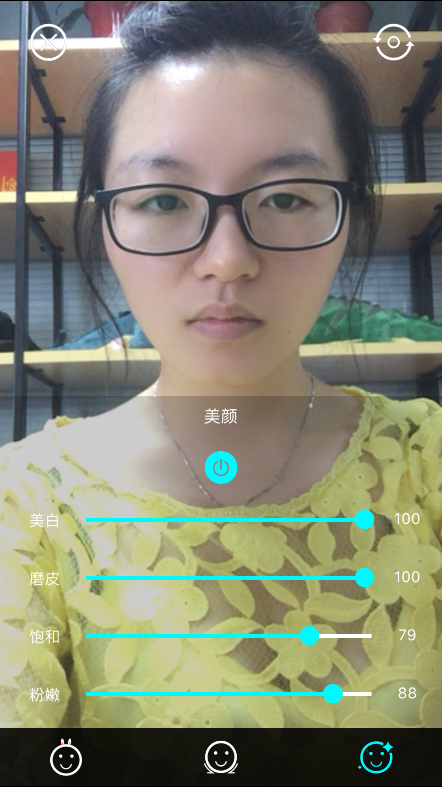

# Kiwi人脸跟踪SDK快速集成指南(iOS)

kiwi人脸跟踪SDK，主要功能包括：

- 静态图片的人脸以及关键点位置检测
- 68个人脸关键点的实时检测与跟踪（单人脸/多人脸）
- 美颜、哈哈镜等实时滤镜功能
- 人脸Pose参数估计
- 趣味2D贴纸

我们的SDK针对移动端，在算法效率、硬件占用、性能精度等方面进行了相关优化，使其适用于移动端直播，美颜相机，滤镜相机，趣味贴纸，虚拟美妆等应用场景。

## 流程图

  

这个文档将演示如何利用我们的demo快速入门，并详细描述具体集成步骤。

## Demo快速入门

该demo基于GPUImage的短视频录制，实现了在短视频录制的场景下实现人脸跟踪以及趣味贴纸。

#### 准备环境

###### 开发环境要求

  软件
    * XCode 6.0 或以上版本
    * iOS 7.0 或以上版本

  硬件
    * 支持语音/视频的真机设备


#### 编译代码示例

1. 用XCode打开demo工程文件(KiwifaceRecordingDemo)。代码包含以下目录结构

  

2. 添加license文件
  - 将从官网下载下来的授权文件（试用此SDK需要在[Kiwi官方网站](http://www.kiwiar.com/demo)中注册，以获取绑定应用BundleID的License文件）放入KWFaceSDK/Tracker/models目录下

	
	
  - 请确认demo工程文件(KiwifaceRecordingDemo)的bundleID是否正确（网站注册时填写的bundleID）
3. 选中项目，点击 "Build and Run" 按钮进行编译

  示例截图

 |  |

p.s. 该示例只支持在真机上实现功能，不支持模拟器。编译完成后，即可运行。


## 具体集成步骤


#### 第一步：准备环境

软件
  * XCode 6.0 或以上版本
  * iOS 7.0 或以上版本

硬件
  * 支持语音/视频的真机设备


#### 第二步：项目所需库

  - __kiwi提供__（请从sdk文件夹中获取）
    * libfaceTrackerSDK.a（人脸捕捉SDK）
    * libKiwiFaceSDK.a（UI＋视频帧渲染SDK）


  - __自行下载__（若项目中已经存在则不需要下载）

    必选：
    * GPUImage视频渲染基于GPUImage SDK（使用GPUImage短视频录制必须使用Demo中的GPUImage SDK）
  	https://github.com/BradLarson/GPUImage.git
    * opencv3.framework
  	https://sourceforge.net/projects/opencvlibrary/files/opencv-ios/3.0.0/

    可选：
    * libyuv (sdk视频帧的渲染暂时只支持NV21格式的传入，如果应用视频帧是YUV或者其他视频流类型，需要导入视频流格式的转换类)
    https://github.com/lemenkov/libyuv.git


  - __系统库__ （xcode自带）
    * UIKit.framework
    * Foundation.framework
    * libz.tbd

#### 第三步：部署工程

1. 导入 libKiwiFaceSDK.a 文件和所有包含的头文件、实现文件、资源文件。（我们提供了两种libKiwiFaceSDK.a文件。libKiwiFaceSDK.a同时支持模拟器与真机，供开发调试使用。libKiwiFaceSDK_release.a仅支持真机，供发布使用。）

  

2. 导入Tracker 人脸捕捉的SDK包和StickerManager。（我们提供了两种libfaceTrackerSDK.a文件。libfaceTrackerSDK_lic.a同时支持模拟器与真机，供开发调试使用。libfaceTrackerSDK_release.a仅支持真机，供发布使用。）

  

  

  这里注意tracker包的models文件夹和StickerManager文件夹下的stickers贴纸文件夹，必须只是导入引用，不要包含到项目工程里面来(文件夹图标为蓝色)。如下图设置：

  

3. 导入GPUImage，用于视频渲染（我们提供了两种libGPUImage.a文件。libGPUImage.a同时支持模拟器与真机，供开发调试使用。libGPUImage_release.a仅支持真机，供发布使用。）
4. 如有需要，导入libyuv

  sdk视频帧的渲染暂时只支持NV21格式的传入 如果应用视频帧是YUV或者其他视频流类型 需要导入视频流格式的转换类。

5. 导入
opencv3.framework

  注意，从官网下载的包有可能被错误的命名为opencv2.framework。

#### 第四步：贴纸配置

  如果有需要，请配置贴纸。贴纸相关文件存放在stickers目录下，一套贴纸对应一个目录，每套贴纸包含一个config.json文件，其中配置了音效文件名及每个item参数等信息。其结构如下：

  ```
  |--[sticker_1] （贴纸1）
  |   |--config.json （贴纸配置文件）
  |   |--[audio]（音频文件）
  |   |--[preview]（贴纸预览图）
  |   |--[item_1]（贴纸序列图文件夹1）
  |   |   |--[frame_1]（贴纸序列图1）
  |   |   |--[frame_2]（贴纸序列图2）
  |   |   |--...
  |   |   |--[frame_n]（贴纸序列图n）
  |   |--[item_2]（贴纸序列图文件夹2）
  |   |--...
  |   |--[item_n]（贴纸序列图文件夹n）
  |--[sticker_2]（贴纸2）
  |--...
  |--[sticker_n]（贴纸n）
  |—StickerConfig.json（总配置文件）
  ```
  程序靠读取在stickers文件夹下的StickerConfig.json显示相应的贴纸和图标。
  
注意，使用贴纸云，需要在Info.plist中加入App Transport Security Settings字段，并将Allow Arbitrary Loads设置为YES。
  __具体的json文件格式如下：__

  StickerConfig.json

  参数名称 | 意义
  --------|----------
	name | 贴纸的名称（UI显示和贴纸的识别）
	dir | 贴纸存放路径文件夹名称
	category | 类别（贴纸类型的区分或分组）
	thumb | 贴纸图标的文件名（与声音在同一文件夹下）
	voiced | true（有声音）false（没有声音播放）
	downloaded | 是否已经下载。如果没有下载，程序则可以去下载到指定目录后更改该状态

  config.json

  参数名称 | 意义
  --------|----------
	type | 贴纸显示的位置类型（脸部、全屏）
	facePos | 贴纸在脸部的位置
	scaleWidthOffset | 贴纸宽度缩放系数
	scaleHeightOffset | 贴纸高度缩放系数
	scaleXOffset | 贴纸在脸部水平方向偏移系数
	scaleYOffset | 贴纸在脸部垂直方向偏移系数
	alignPos | 边缘item参数
	alignX | 边缘水平方向偏移系数
	alignY | 边缘垂直方向系数
	frameFolder | 贴纸资源目录（包括一组图片序列帧）
	frameNum |  帧数（一组序列帧组成一个动画效果）
	frameDuration | 每帧的间隔（秒）
	frameWidth | 图片的宽
	frameHeight | 图片的高
	trigerType | 触发条件，默认0，始终显示

  编写config.json文件可使用我司提供的[贴纸配置网站](https://apps.kiwiapp.mobi/sticker.html)进行调试生成。

#### 第五步：调用API

###### 使用SDK内置UI

如果直接使用我们SDK内置的UI, 可以在页面的viewDidload里面初始化SDK。

```c
/* 获得SDK操作类的实例对象 */
self.kwSdkUI = [KiwiFaceSDK_UI shareManagerUI];
/* 设置SDK内置UI的 ViewController 如果不用内置UI 不用设置 */
[self.kwSdkUI setViewDelegate:self];
/* 初始化SDK 一些渲染对象以及初始参数 */
[self.kwSdkUI.kwSdk initSdk];
/* 如果使用内置UI 该属性是判断是否清除原有项目的页面UI 如果原有UI功能少 可以用内置UI 替代 一般来说用不到 */
self.kwSdkUI.isClearOldUI = NO;
 /* 初始化内置UI */
[self.kwSdkUI initSDKUI];
 /* 渲染视频帧，在每一帧视频代理函数中调用 */
self.kwSdkUI.kwSdk = [KiwiFaceSDK sharedManager];
/*
对每一帧的视频图像进行人脸捕捉 并对当前选择的滤镜进行视频帧渲染
pixelBuffer：每一帧的像素流
cvMobileRotate ：屏幕方向（横竖屏）
mirrored： 是否是镜像
*/
[kwSdk.renderer processPixelBuffer:pixelBuffer withRotation:cvMobileRotate mirrored:mirrored];
/* 
最大跟踪人脸个数
default:4
1 <= maxFaceNumber <= 5
*/
self.kwSdkUI.kwSdk.maxFaceNumber = 5;
```

###### 使用sdk自带功能


* 人脸关键点和贴纸：

  * 初始化人脸关键点和贴纸集合

    ```c
    self.filters = @[
       //描点
       [KWPointsRenderer new],
       //贴纸
       [KWStickerRenderer new]
    ];
    ```
    * 调用人脸关键点和贴纸集合
    
    ```c
		//调用描点
		[self.renderer addFilter:self.filters[0]];
		//调用贴纸
		[self.renderer addFilter:self.filters[1]];
      ```

  * 初始化哈哈镜滤镜集合

    ```c       
    self.distortionFilters = @[
         //方脸
         [GPUImageSquareFaceFilter new],
         //ET脸
         [ETnewFilter new],
         //胖脸
         [FatFaceFilter new],
         //蛇精脸
         [SlimFaceFilter new],
         //梨脸
         [PearFaceDistortionFilter new]
    ];
    ```

  * 初始化美颜滤镜集合
  
    ```c
    self.beautifyFilters = @[
         //大眼
         [SmallFaceBigEyeFilter new]
    ];

    self.beautifyNewFilters = @[
         //美颜
         [GPUImageBeautifyFilter new]
    ];
    ```

  * 初始化全局滤镜集合
  
    ```c
    self.lookupFilters = @[
         //Nature
         [[FTLookupFilter alloc] initWithType:FTLookupTypeNature],
         //Sweety
         [[FTLookupFilter alloc] initWithType:FTLookupTypeSweety],
         //Clean
         [[FTLookupFilter alloc] initWithType:FTLookupTypeClean],
         //Peach
         [[FTLookupFilter alloc] initWithType:FTLookupTypePeach],
         //Rosy
         [[FTLookupFilter alloc] initWithType:FTLookupTypeRosy],
         //Urban
         [[FTLookupFilter alloc] initWithType:FTLookupTypeUrban]
    ];
    ```

* 调用具体功能：

  ```c
  //调用美颜
  [self.renderer addFilter:self.beautifyNewFilters[0]];
  //调用哈哈镜
  [self.renderer addFilter:self.currentDistortionFilter];
  //调用滤镜
  [self.renderer addFilter:self.currentLookupFilter];
  //调用贴纸
  [self.renderer addFilter:self.filters[1]];
  ```

* 去除具体功能：

  ```c
  //去除美颜
  [self.renderer removeFilter:self.beautifyNewFilters[0]];
  //去除描点
  [self.renderer removeFilter:self.filters[0]];
  //去除哈哈镜
  [self.renderer removeFilter:self.currentDistortionFilter];
  //去除滤镜
  [self.renderer removeFilter:self.currentLookupFilter];
  //去除贴纸
  [(FTStickerRenderer *)self.filters[1] setSticker:nil];
  ```

###### 自定义功能扩展

* 增加特定滤镜，进行渲染：

  在 sdk入口类中，有一个类型为KWRenderer的渲染类，由他来控制滤镜的增加。
  
  ```
  [KiwiFaceSDK.KWRenderer addFilter: GPUImageOutput<GPUImageInput, KWRenderProtocol> *];
  ```
  滤镜对象必须遵守GPUImageInput和KWRenderProtocol两个协议才能正常被人脸捕捉和渲染。

* 删除特定滤镜，停止渲染：

  ```
  [KiwiFaceSDK.KWRenderer removeFilter: GPUImageOutput<GPUImageInput, KWRenderProtocol> *];
  ```
* 人脸捕捉之后，在渲染视频帧之前可以对每一帧图像做自定义处理的回调block：

  ```
  typedef void (^RenderAndGetFacePointsBlock)(unsigned char *pixels, int format, int width, int height,result_68_t *p_result, int rstNum, int orientation,int faceNum);
  //block属性
  @property (nonatomic, copy)RenderAndGetFacePointsBlock kwRenderBlock;
  ```
  block 回调用于在人脸捕捉之后，渲染之前，可以对视频帧进行自定已处理的接口。Block的3个参数可供处理和使用：
  - result ：人脸坐标集合 （可能是多张人脸 是二维数组）
  - faceNum ：捕捉到的人脸数量
  - pixelBuffer：单帧的像素流


###### 释放内存

我们建议在离开页面的时候释放内存

```c
[KiwiFaceSDK releaseManager];
```
